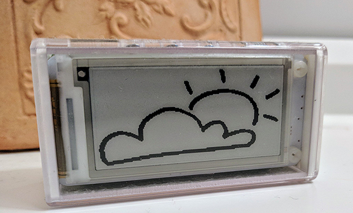

Doodle-Dashboard: Simple dashboards for all!
============================================

.. image:: https://img.shields.io/pypi/v/doodle-dashboard.svg
    :target: https://pypi.org/project/doodle-dashboard/
    :alt: Latest version

.. image:: https://img.shields.io/pypi/pyversions/doodle-dashboard.svg
    :target: https://pypi.org/project/doodle-dashboard/
    :alt: PyPI - Python Version

.. image:: https://travis-ci.org/SketchingDev/Doodle-Dashboard.svg?branch=master
    :target: https://travis-ci.org/SketchingDev/Doodle-Dashboard
    :alt: Build status

.. image:: https://readthedocs.org/projects/doodle-dashboard/badge/?version=latest
    :target: https://doodle-dashboard.readthedocs.io/en/latest/?badge=latest
    :alt: Documentation status

.. image:: https://coveralls.io/repos/github/SketchingDev/Doodle-Dashboard/badge.svg?branch=master
    :target: https://coveralls.io/github/SketchingDev/Doodle-Dashboard?branch=master
    :alt: Test coverage

.. image:: https://img.shields.io/lgtm/grade/python/g/SketchingDev/Doodle-Dashboard.svg?logo=lgtm&logoWidth=18
    :target: https://lgtm.com/projects/g/SketchingDev/Doodle-Dashboard/context:python
    :alt: Language grade: Python

---------------

**Doodle-Dashboard** is used to create dashboards for displaying information from multiple sources; such as
Tweets from your favourite Twitterers, notifications from Slack or breaking news from an RSS feed.

**WARNING: This project is under heavy development and will not have a reliable API until a stable version is released.**

Requirements
------------

  * `Python 3.4+ <https://www.python.org/downloads/>`_
  * `pip <https://pip.pypa.io/en/stable/installing/>`_

Getting started
---------------

1. Install package::

    pip install doodle-dashboard

2. Start a dashboard:

A dashboard is a YAML file that declares the display to use and the notification to display on it. Dashboard files can be hosted
locally or remotely.

Starting a single dashboard::

    doodledashboard start \
      https://raw.githubusercontent.com/SketchingDev/Doodle-Dashboard/master/examples/rss/weather/dashboard.yml

Starting multiple dashboards::

    doodledashboard start \
      https://raw.githubusercontent.com/SketchingDev/Doodle-Dashboard/master/examples/rss/weather/dashboard.yml \
      https://raw.githubusercontent.com/SketchingDev/Doodle-Dashboard/master/examples/rss/build-radiator/dashboard.yml

Development
-----------

These steps assume that you're using virtualenv.

1. Clone the repository::

    $ git clone https://github.com/SketchingDev/Doodle-Dashboard.git
    $ cd doodle-dashboard

2. Prepare project dependencies::

    $ make dev
    $ export PYTHONPATH=`pwd`

3. See usage help::

    $ python doodledashboard/cli.py

Refer to the `documentation <https://doodle-dashboard.readthedocs.io/en/latest/development.html>`_ for more detailed instructions.
